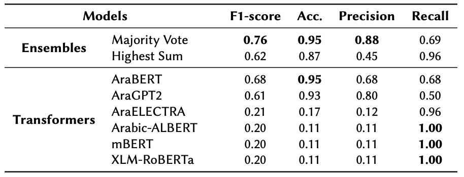

# Transformers and Ensemble methods: A solution for Hate Speech Detection in the Arabic language




# Description
This repository contains the code for the paper **Transformers and Ensemble methods: A solution for Hate Speech Detection in the Arabic language**, where we describe our participation in the [CERIST NLP Challenge 2022](http://www.nlpchallenge.cerist.dz/). This paper will be published by the [journal Revue de l'Information Scientifique et Technique](https://www.asjp.cerist.dz/en/PresentationRevue/134). Descriptions of the implementation and the dataset are contained in the [paper](https://arxiv.org/pdf/2303.09823.pdf).


# Paper Abstract
This paper describes our participation in the shared task of hate speech detection, which is one of the subtasks of the CERIST NLP Challenge 2022. Our experiments evaluate the performance of six transformer models and their combination using 2 ensemble approaches. The best results on the training set, in a five-fold cross validation scenario, were obtained by using the ensemble approach based on the majority vote. The evaluation of this approach on the test set resulted in an F1-score of 0.60 and Accuracy of 0.86


# Cite
If you find this [article](https://arxiv.org/pdf/2303.09823.pdf) or the [code](https://github.com/AngelFelipeMP/Arabic-Hate-Speech-Covid-19) useful in your research, please cite us as:


```
@article{angelfmp@cerist2022,
  title={Transformers and Ensemble methods: A solution for Hate Speech Detection in Arabic languages},
  author={Magnoss{\~a}o de Paula, Angel Felipe and  Bensalem, Imene and  Rosso, Paolo  and  Zaghouani, Wajdi},
  journal={Revue de l'Information Scientifique et Technique},
  year={2023}
}
```

# Credits
CERIST NLP challenge 2022 Organizers

CERIST NLP Challenge website: http://www.nlpchallenge.cerist.dz/

Contact: nlpchallenge@cerist.dz
